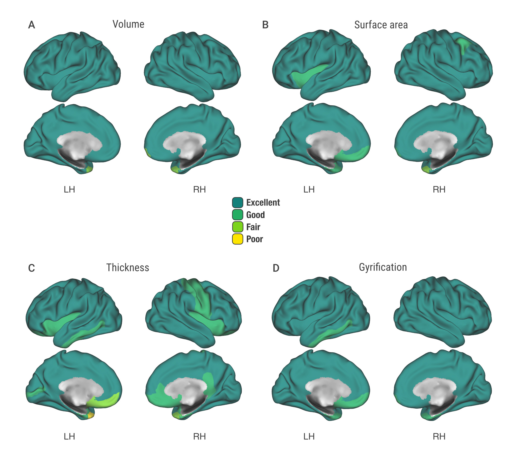

```{r}
# Load packages  ---------------------------

# this installs missing packages, description below
list_of_packages <- c("tidyverse", "here", "lubridate", "ICC", 
                      "hrbrthemes", "extrafont", "glue"
)

new_packages <- list_of_packages[!(list_of_packages %in%
                                     installed.packages()[,"Package"])]
if(length(new_packages)) install.packages(new_packages)

# load packages
library(tidyverse) # ggplot, dplyr, tidyr, readr, purr, tibble
library(here) # here() starts at R Project directory, cross platform paths
library(lubridate) # working with dates
library(ICC) # ICC and CI
library(hrbrthemes) # plots with custom fonts
library(glue) # interpolate data into strings
library(extrafont) # for additional fonts, such as Roboto condensed

# Data import  ---------------------------
df <- read_csv("data/youth_scan_rescan.csv")
```


# Reliability (ICC)

> The ICC can be interpreted as “the proportion of the variance explained by the grouping structure in the population”

ICCs are classified according to Cicchetti as 

* poor (<0.40)
* fair (0.41–0.59)
* good (> 0.59 – 0.74) 
* excellent (> 0.74) 


## Main functions

* Click the code button on the right to expand text field containing the primary functions used in this analysis.
* They primarily rely on the `tidyverse` series of packages for data wrangling and the `ICCest` package for ICC calculations.

```{r}
# Helper functions using ICCest package to calc ICC and CI
est_lower_icc <- function(x){ICCest(scan_id, value, data = x)$LowerCI}
est_icc <- function(x){ICCest(scan_id, value, data = x)$ICC}
est_upper_icc <- function(x){ICCest(scan_id, value, data = x)$UpperCI}

# ICC function
classify_icc <- function(x) {
  # this function takes a "long" data frame
  # then calculates the ICC w/ the 95% CI per ROI
  # it then classifies the ICC according to set criteria
  # finally it creates a grouping variable for the hemispheres
  x %>%
  # nest by ROI for regional output
  tidyr::nest(-ROI) %>%
  # use previously defined est_icc functions
  dplyr::mutate(
    `2.5% CI` = purrr::map(data, est_lower_icc),
    `ICC` = purrr::map(data, est_icc),
    `97.5% CI` = purrr::map(data, est_upper_icc)) %>%
  tidyr::unnest(`2.5% CI`, `ICC`, `97.5% CI`, .drop = T) %>%
  # classify based on Cicchetti
  dplyr::mutate(Classification = case_when(
    ICC > 0.74 ~ "Excellent",
    ICC <= 0.74 & ICC > 0.59 ~ "Good",
    ICC <= 0.59 & ICC > 0.40 ~ "Fair",
    ICC < 0.40  ~ "Poor")) %>%
  # create hemisphere variable
  dplyr::mutate(hemi = case_when(
    grepl("_L_", ROI) ~ "lh",
    grepl("_R_", ROI) ~ "rh",
    TRUE ~ "bilateral")
  )
}

# function to print results inline in the r notebook
print_inline_icc <- function(x){
  # overall averaged
  overall_m <- signif(mean(x$ICC), 2)
  overall_l <- signif(mean(x$"2.5% CI"), 2)
  overall_u <- signif(mean(x$"97.5% CI"), 2)
  # by hemisphere
  lh_m <- signif(mean(x[x$hemi == "lh", ]$ICC), 2)
  lh_l <- signif(mean(x[x$hemi == "lh", ]$"2.5% CI"), 2)
  lh_u <- signif(mean(x[x$hemi == "lh", ]$"97.5% CI"), 2)
  rh_m <- signif(mean(x[x$hemi == "rh", ]$ICC), 2)
  rh_l <- signif(mean(x[x$hemi == "rh", ]$"2.5% CI"), 2)
  rh_u <- signif(mean(x[x$hemi == "rh", ]$"97.5% CI"), 2)
  # print in line in notebook
  glue::glue('
  The overall ICC for this measure is M = {overall_m}, 
  95% CI [{overall_l}, {overall_u}]. 
  The left hemisphere average ICC is {lh_m}, 95% CI [{lh_l}, {lh_u}]. 
  The right hemisphere average ICC is {rh_m}, 95% CI [{rh_l}, {rh_u}]. 
  ')
}
```

---

# Grey matter ICC 

## Figure 1


## Table 1. Grey matter volume {.tabset .tabset-pills}

```{r}
# creates data table
gm <- df %>%
  # wrangles data from wide to long and select variables of interest
  select(starts_with("scan"), contains("GrayVol")) %>% 
  gather("ROI", "value", contains("GrayVol")) %>%
  # uses function defined above to calc ICC
  classify_icc()
  
# ROI string cleanup for table
gm$ROI <- gm$ROI %>%
  str_replace_all(c("FS_._" = "", "_GrayVol" = ""))
```
  
`r print_inline_icc(gm)`

The table below shows regional ICC based on the Desikan atlas. 

### Left hemisphere

```{r}
gm %>% 
  filter(hemi == "lh") %>% 
  select(-hemi)
```

### Right hemisphere

```{r}
gm %>% 
  filter(hemi == "rh") %>% 
  select(-hemi)
```

## Table 2. Surface area {.tabset .tabset-pills}

```{r}
area <- df %>%
  select(starts_with("scan"), starts_with("FS_"), -ends_with("GrayVol")) %>%
  gather("ROI", "value", contains("_Area")) %>%
  # uses function defined above to calc ICC
  classify_icc()

area$ROI <- area$ROI %>%
  str_replace_all(c("FS_._" = "", "_Area" = ""))
```

`r print_inline_icc(area)`

### Left hemisphere

```{r}
area %>% 
  filter(hemi == "lh") %>% 
  select(-hemi)
```

### Right hemisphere

```{r}
area %>% 
  filter(hemi == "rh") %>% 
  select(-hemi)
```

## Table 3. Thickness {.tabset .tabset-pills}

```{r}
thick <- df %>%
  select(starts_with("scan"), starts_with("FS_"), -ends_with("GrayVol")) %>%
  gather("ROI", "value", contains("_Thck")) %>%
  classify_icc()

thick$ROI <- thick$ROI %>%
  str_replace_all(c("FS_._" = "", "_Thck" = ""))
```

`r print_inline_icc(thick)`

### Left hemisphere

```{r}
thick %>% 
  filter(hemi == "lh") %>% 
  select(-hemi)
```

### Right hemisphere

```{r}
thick %>% 
  filter(hemi == "rh") %>% 
  select(-hemi)
```

## Table 4. Cortical folding (LGI) {.tabset .tabset-pills}

```{r}
lgi <- df %>%
  select(starts_with("scan"), starts_with("LGI"), -ends_with("Area")) %>%
  gather("ROI", "value", contains("Mean")) %>%
  classify_icc()

lgi$ROI <- lgi$ROI %>%
  str_replace_all(c("LGI_._" = "", "_Mean" = ""))
```

`r print_inline_icc(lgi)`

### Left hemisphere
  
```{r}
lgi %>% 
  filter(hemi == "lh") %>%
  select(-hemi)
```


### Right hemisphere

```{r}
lgi %>% 
  filter(hemi == "rh") %>%
  select(-hemi)
```


# White matter ICC 

Reliability of ROIs in the JHU_WM20 atlas. The JHU white-matter tractography atlas, __20 structures__ were identified probabilistically by averaging the results of running deterministic tractography on 28 normal subjects (mean age 29, M:17, F:11).


---

## Table 5. WM volume {.tabset .tabset-pills}

```{r}
wmvol <- df %>%
  select(starts_with("scan"), starts_with("JHU_WM20")) %>%
  gather("ROI", "value", contains("vol")) %>%
  # run icc
  classify_icc()

# clean strings for table
wmvol$ROI <- wmvol$ROI %>%
  str_replace_all(c("JHU_WM20_" = "", "_._vol" = "", "_vol" = ""))
```

`r print_inline_icc(wmvol)`

### Left hemisphere
```{r}
wmvol %>% 
  filter(hemi == "lh" | hemi == "bilateral") %>%
  select(-hemi)
```

### Right hemisphere
```{r}
wmvol %>% 
  filter(hemi == "rh" | hemi == "bilateral") %>%
  select(-hemi)
```

## Table 6. Fractional anisotropy (FA) {.tabset .tabset-pills}

```{r}
# data setup for all DTI measures
dti <- df %>%
  select(starts_with("scan"), matches("JHU_WM"), -ends_with("vol")) %>%
  gather("ROI", "value", contains("_mean")) %>%
  classify_icc()

fa <- dti %>% # filter FA
  filter(grepl('JHU_WM20', ROI)) %>%
  filter(grepl('FA', ROI)) 

# clean strings for table
fa$ROI <- fa$ROI %>%
  str_replace_all(c("JHU_WM20_" = "", 
                    "_._FA_mean" = "", 
                    "_FA_mean" = ""))
```

`r print_inline_icc(fa)`

### Left hemisphere
  
```{r}
fa %>% 
  filter(hemi == "lh" | hemi == "bilateral") %>% 
  select(-hemi)
```

### Right hemisphere

```{r}
fa %>% 
  filter(hemi == "rh" | hemi == "bilateral") %>%
  select(-hemi)
```


## Table 7. Radial diffusivity (RD) {.tabset .tabset-pills}
```{r}
rd <- dti %>% # filter FA
  filter(grepl('JHU_WM20', ROI)) %>%
  filter(grepl('RD', ROI)) 

# clean strings for table
rd$ROI <- rd$ROI %>%
  str_replace_all(c("JHU_WM20_" = "", 
                    "_._RD_mean" = "", 
                    "_RD_mean" = ""))
```

`r print_inline_icc(rd)`

### Left hemisphere

```{r}
rd %>% 
  filter(hemi == "lh" | hemi == "bilateral") %>% 
  select(-hemi)
```

### Right hemisphere

```{r}
rd %>% 
  filter(hemi == "rh" | hemi == "bilateral") %>%
  select(-hemi)
```

## Table 8. Mean diffusivity (MD) {.tabset .tabset-pills}

```{r}
md <- dti %>% 
  filter(grepl('JHU_WM20', ROI)) %>%
  filter(grepl('MD', ROI))

# clean strings for table
md$ROI <- md$ROI %>%
  str_replace_all(c("JHU_WM20_" = "", 
                    "_._MD_mean" = "", 
                    "_MD_mean" = ""))
```

`r print_inline_icc(md)`

### Left hemisphere

```{r}
md %>% 
  filter(hemi == "lh" | hemi == "bilateral") %>% 
  select(-hemi)
```

### Right hemisphere

```{r}
md %>% 
  filter(hemi == "rh" | hemi == "bilateral") %>%
  select(-hemi)
```

## Table 9. Axial diffusivity (AD) {.tabset .tabset-pills}

```{r}
ad <- dti %>% 
  filter(grepl('JHU_WM20', ROI)) %>%
  filter(grepl('AD', ROI)) 

# clean strings for table
ad$ROI <- ad$ROI %>%
  str_replace_all(c("JHU_WM20_" = "", 
                    "_._AD_mean" = "", 
                    "_AD_mean" = ""))
```

`r print_inline_icc(ad)`


### Left hemisphere

```{r}
ad %>% 
  filter(hemi == "lh" | hemi == "bilateral") %>% 
  select(-hemi)
```

### Right hemisphere

```{r}
ad %>% 
  filter(hemi == "rh" | hemi == "bilateral") %>%
  select(-hemi)
```

## Figure 2

```{r}
# label datasets
fa <- fa %>% mutate(dat = "FA")
rd <- rd %>% mutate(dat = "RD")
md <- md %>% mutate(dat = "MD")
ad <- ad %>% mutate(dat = "AD")

# combine datasets into one for plotting
omni_dat <- bind_rows(fa, rd, md, ad)
```

```{r}
# needs free Roboto Condensed font
# https://fonts.google.com/specimen/Roboto+Condensed

# load fonts based on OS
if(.Platform$OS.type == "Windows") {
  extrafont::loadfonts(device = "win")
} else {
  extrafont::loadfonts()
}

# wrangle data for plot
omni_dat %>% 
  group_by(dat) %>%
  summarise(ICC = mean(ICC),
            lower = mean(`2.5% CI`),
            upper = mean(`97.5% CI`)
            ) %>%
  # re-order by ICC value
  mutate(dat = fct_reorder(dat, ICC)) %>%
  ggplot(aes(x = dat, y = ICC, label = signif(ICC, 2))) + 
  geom_errorbar(aes(ymin = lower, ymax = upper), 
                width = 0.15, size = 0.85, color = "#1D7F79") +
  # modern theme w/ roboto font
  hrbrthemes::theme_ipsum_rc() + 
  geom_point(size = 8.5, color = "#1D7F79") +
  geom_text(color = "white", size = 3) +
  scale_y_continuous(limits = c(0.64, 0.95), 
                     breaks = seq(0.65, 1, 0.05)) +
  labs(title = "DTI Reliability", 
       subtitle = "Scan-rescan ICC of DTI measures",
       x = "DTI Measures",
       y = "Reliability (ICC)",
       caption = "AD = Axial Diffusivity, MD = Mean Diffusivity, 
       RD = Radial Diffusivity, FA = Fractional Anisotropy. 
       Error bars represent 95% confidence intervals.")

# save plot
# ggsave("figs/DTI_ICC_Plot.png", dpi = 300, # change for pub
#       width = 7.25, height = 5)

# for OHBM2019 figure
# save plot
ggsave("figs/DTI_ICC_Plot.png", dpi = 1000, # change for pub
       width = 6, height = 5.25)

```

```{r eval=FALSE, include=FALSE}
# for visualizing relative ICC across all data
fa <- fa %>% mutate(dat = "FA")
rd <- rd %>% mutate(dat = "RD")
md <- md %>% mutate(dat = "MD")
ad <- ad %>% mutate(dat = "AD")
gm <- gm %>% mutate(dat = "GM")
sa <- area %>% mutate(dat = "SA")
ct <- thick %>% mutate(dat = "CT")
lgi <- lgi %>% mutate(dat = "lgi")

# combine datasets into one for plotting
all_dat <- bind_rows(gm, sa, ct, lgi, fa, rd, md, ad)

# view lower bound CI cross into poor
all_dat %>% 
  arrange(ICC) %>% 
  filter(Classification != "Excellent") %>%
  group_by(dat, ROI)
```

